# Práctica de programación básica con Scala

## Autor
* **Nombre y apellidos:** Noelia Segura Herrero
* **Entorno del sistema:** Windows 11 / Python 3.13.5 / Scala 2.12.21

=======

## 1.1. Entorno 1 — JupyterLab + Almond Kernel + Scala 2.12.21

### Instalar JupyterLab

1. Comprobar que tenemos instalado Python: Verifica que Python esté disponible.

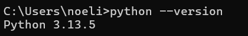

## Resumen del Entorno 1: JupyterLab + Almond Kernel + Scala 2.12.21

En este entorno se ha preparado una interfaz interactiva basada en JupyterLab para la ejecución de código Scala utilizando el kernel de Almond. El proceso incluyó la instalación de Python, la actualización de `pip`, la instalación de JupyterLab y la descarga de Coursier para compilar e instalar el kernel de Scala 2.12.21, permitiendo la ejecución de celdas de código de forma interactiva.

---

## Apartado de Evidencias (Entornos de trabajo y pruebas)

### 1. JupyterLab ejecutándose
* **Descripción de la evidencia:** Captura que muestra la interfaz principal de inicio de JupyterLab en funcionamiento y el explorador de archivos.

[Inserta tu imagen aquí debajo:]
<!--  -->

---

### 2. Almond disponible como kernel
* **Descripción de la evidencia:** Captura del Launcher de JupyterLab donde se visualiza el icono de Scala (Almond Kernel) disponible junto a los de Python.

[Inserta tu imagen aquí debajo:]
 

---

### 3. Notebook utilizando Scala y versión de Scala utilizada
* **Descripción de la evidencia:** Captura del notebook interactivo ejecutando las sentencias de verificación de versión:

[Inserta tu imagen aquí debajo:]
 
=======
2. Actualizar pip: Asegura tener la última versión.

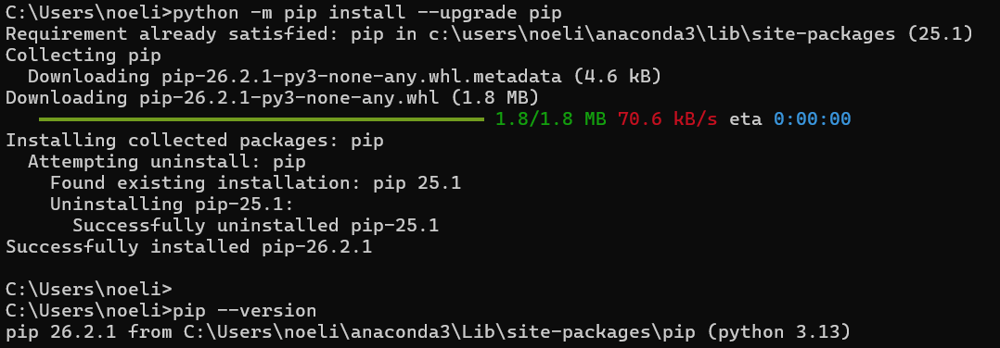

3. Instalar JupyterLab y comprobar la versión:

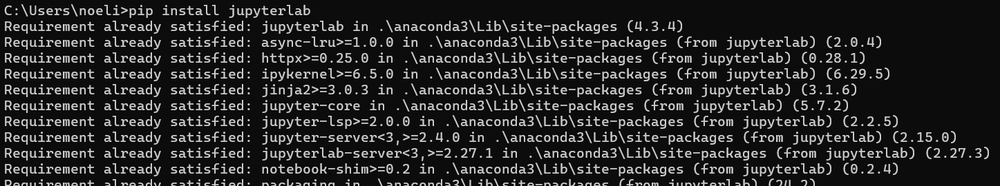

4. Iniciar JupyterLab: Abre el servidor local y la interfaz web.

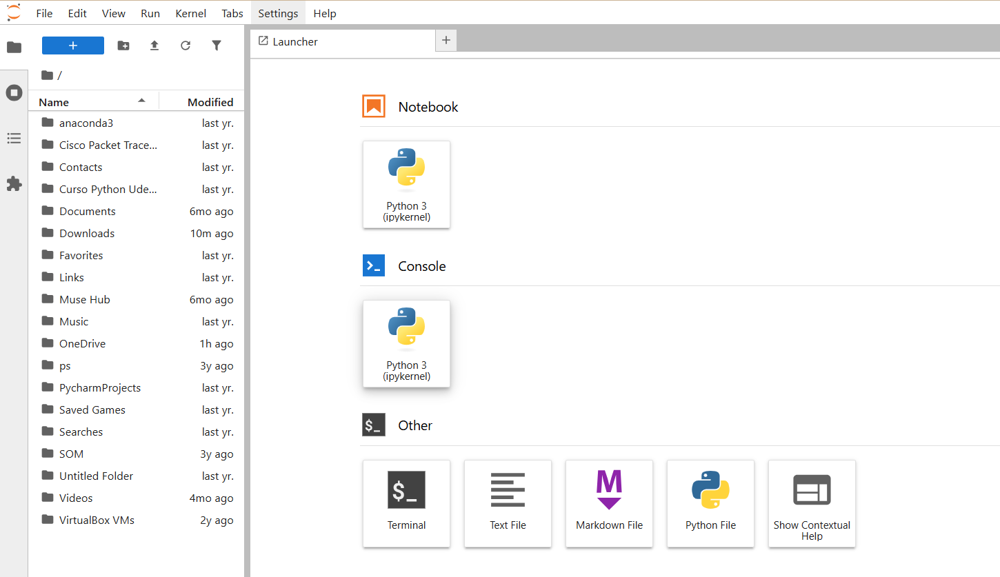

### Instalar Almond Kernel

1. En la PowerShell: Ir a tu carpeta de usuario y descargar Coursier.

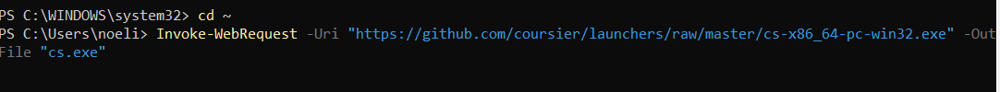

2. Instala el kernel en Jupyter: Ejecuta Coursier para registrar el núcleo de Scala 2.12.21 en Jupyter

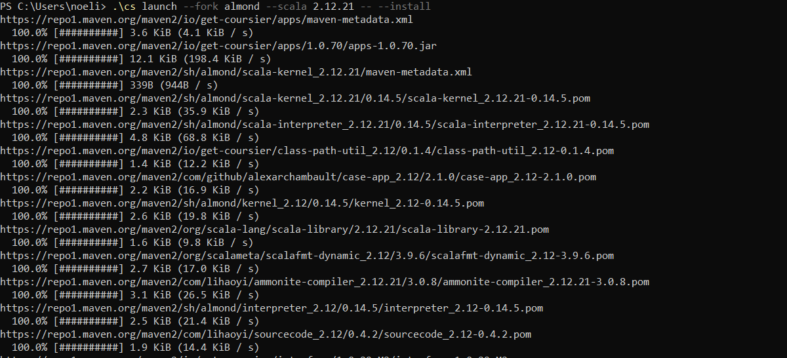

3. Iniciar en JupyterLab: Vuelve a abrir la interfaz para comprobar

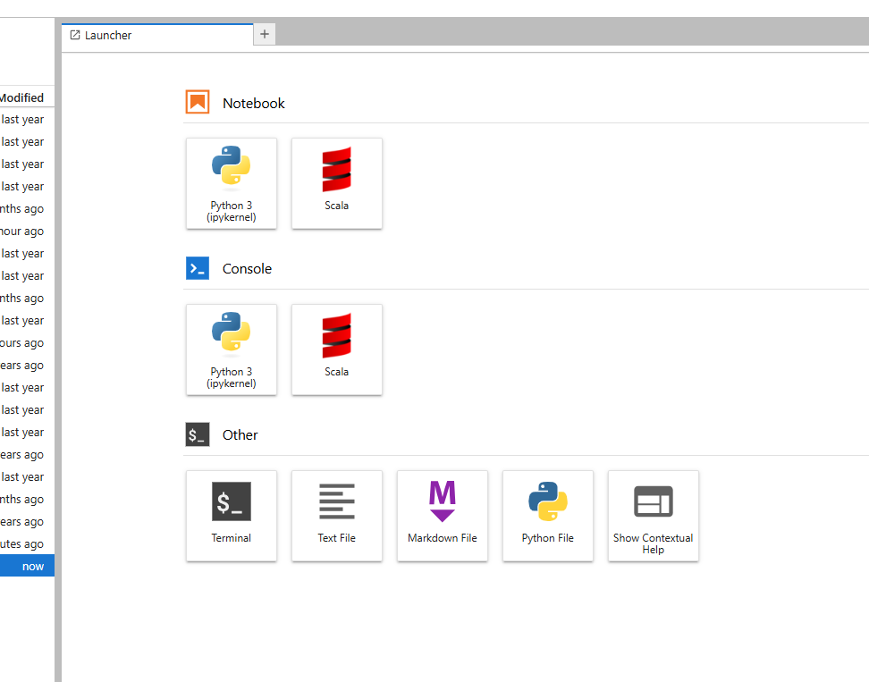

### Verificar la versión de Scala

1. Crear un nuevo Notebook de Scala y ejecutar el código de verificación:

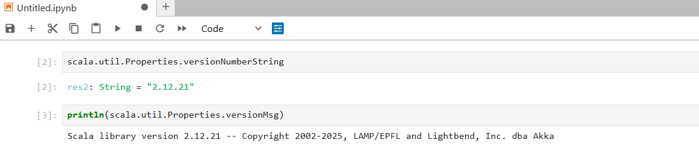

### Ejecutar código Scala

1. Creamos una celda y ejecutamos lo siguiente:

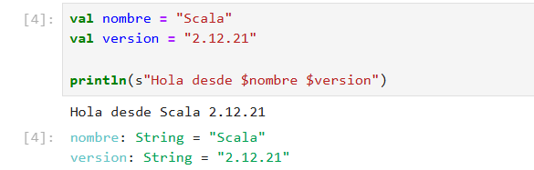

2. Ahora realizamos la operación numérica.

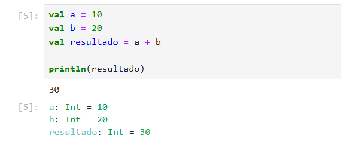

3. En una tercera celda creamos una colección sencilla.

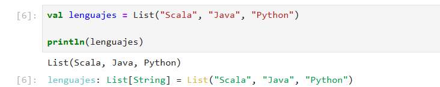
>>>>>>> 51c3e2a4cf6ddc2a2112e421e1f357e3f0d8fc8b
