## 1.2. Entorno 2 — Visual Studio Code + Metals + Scala 2.12.21 + JDK 17 + sbt

En este segundo entorno se monta el flujo de trabajo con Visual Studio Code como editor y Metals como servidor de lenguaje (LSP) para Scala. A diferencia del Entorno 1, aquí se trabaja con proyectos gestionados por sbt en lugar de notebooks.

1. Ejecutar winget

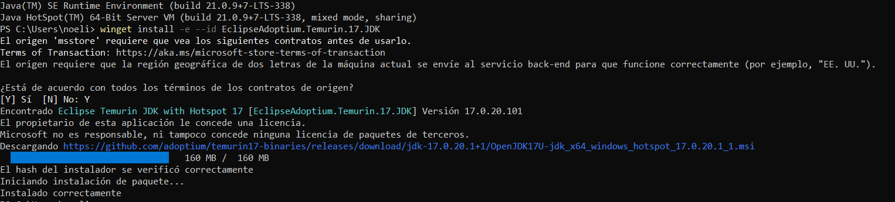

2. Comprobamos la version

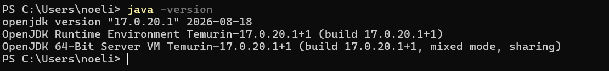

### Instalar Visual Studio Code

1. Ya tenía la instalación hecha con anterioridad

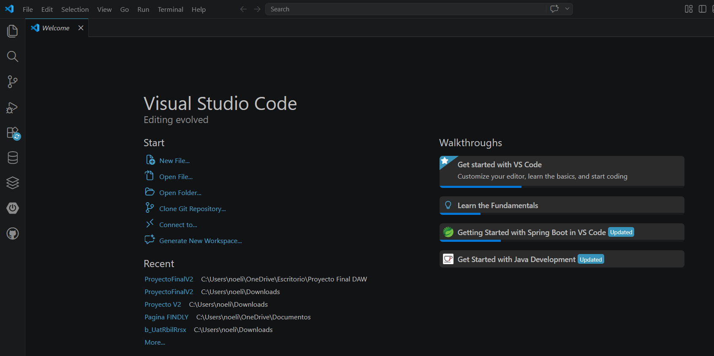

2. Versión instalada:

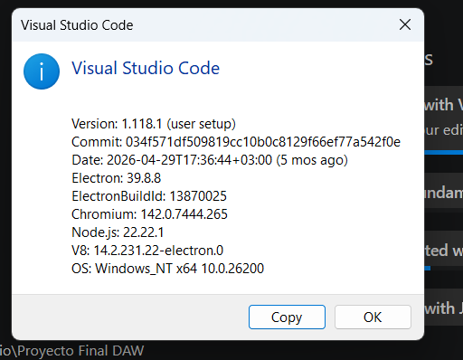

### Instalar Metals

1. Buscamos la extensión en Visual Studio Code

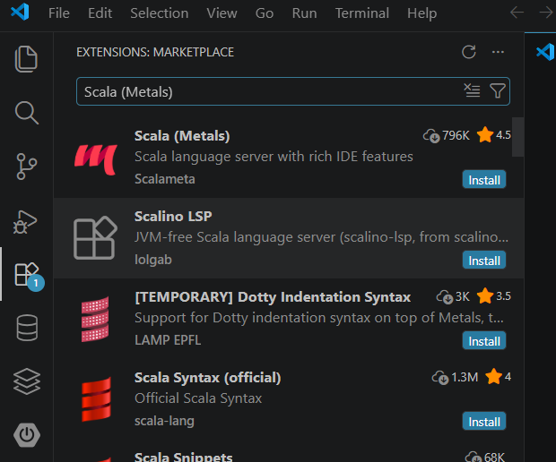

2. Versión instalada

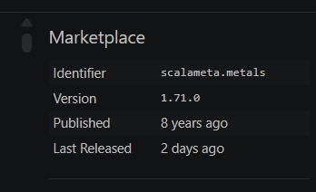

### Instalar y comprobar sbt

1. Buscar el ID correcto de sbt

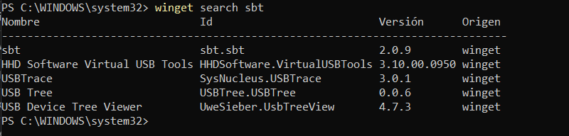

2. Ejecutar winget con sbt.sbt

3. Verificar versión

### Crear un proyecto Scala con sbt

1. Creamos la estructura de carpetas

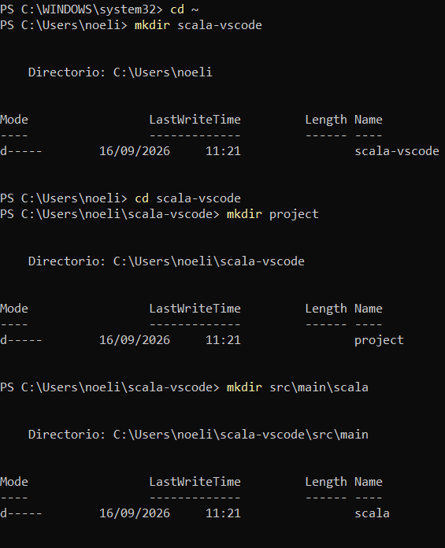

### Configurar Scala 2.12.21

1. Crear y configurar build.sbt

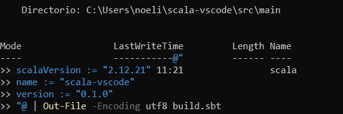

2. Comprobamos que se ha creado correctamente

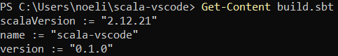

### Crear el programa

Una vez configurado el proyecto, se crea el archivo `Main.scala` dentro de `src/main/scala` con un programa de ejemplo sencillo que sirva para comprobar que todo el entorno funciona correctamente.

1. Crear el archivo Main.scala con el código de ejemplo

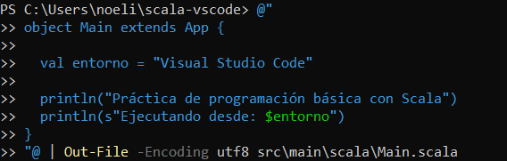

2. Verificación:

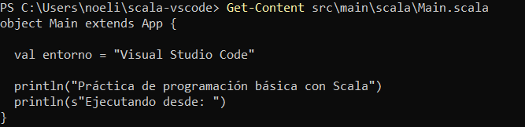

### Importar el proyecto con Metals

Para que Metals pueda ofrecer autocompletado y detección de errores, es necesario abrir la carpeta del proyecto en Visual Studio Code y dejar que Metals lo importe e indexe automáticamente.

1. Abrimos la carpeta creada anteriormente

2. Una vez abierto se importa el proyecto automáticamente y empieza a cargar en la terminal

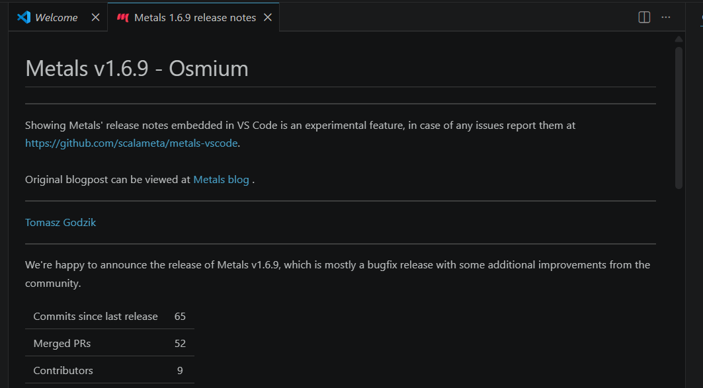

### Compilar el proyecto

Antes de ejecutar el programa, se compila el proyecto para comprobar que no existen errores de sintaxis ni de dependencias.

1. Ejecutar el comando de compilación

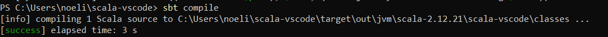

### Ejecutar el proyecto

Por último, se ejecuta el proyecto desde sbt para comprobar que el programa Scala funciona correctamente de principio a fin.

1. Ejecutamos:

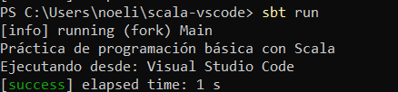
