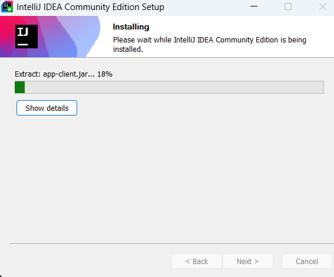
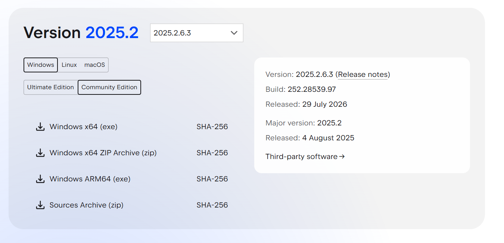
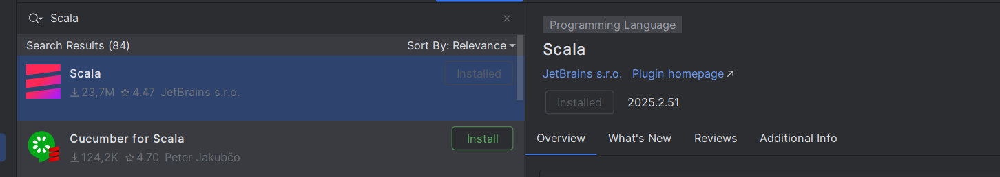
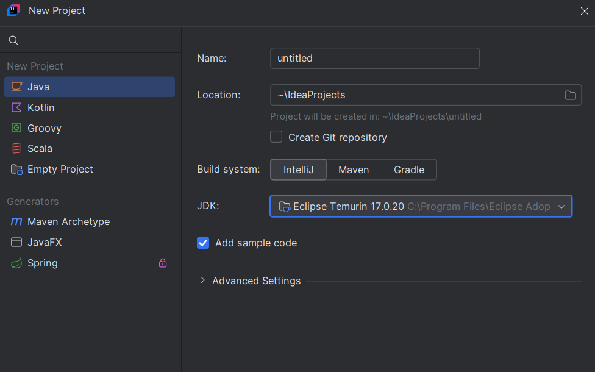
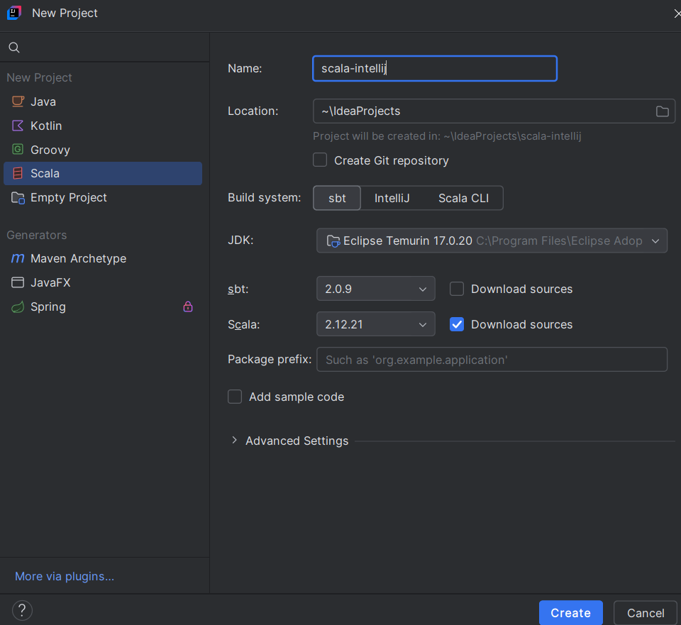
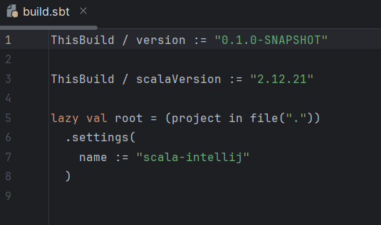
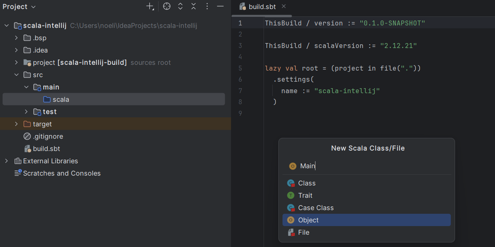
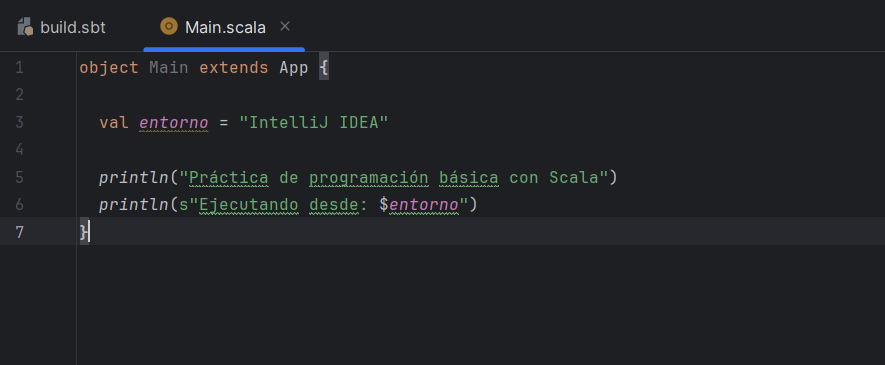
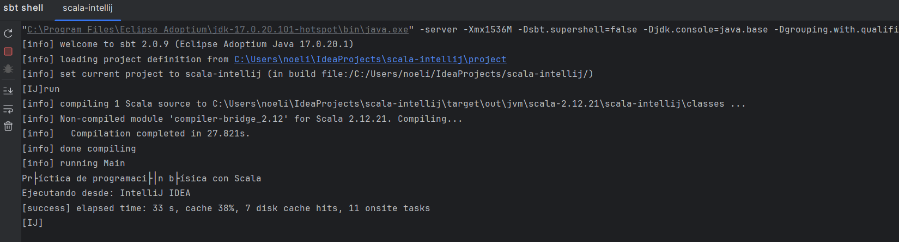
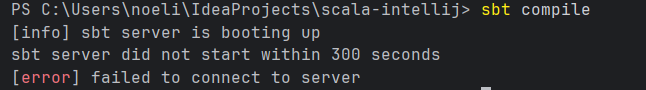

## 1.3. Entorno 3 — IntelliJ IDEA Community + Scala 2.12.21 + sbt

El tercer entorno utiliza IntelliJ IDEA Community Edition como IDE, apoyándose en su plugin oficial de Scala para dar soporte al lenguaje y en sbt como herramienta de compilación y ejecución del proyecto. 

### Instalar IntelliJ IDEA Community Edition

Se instala la edición Community, que es gratuita y suficiente para el desarrollo en Scala.
1. Instalamos esta versión

### Instalar el soporte para Scala

Por defecto IntelliJ no incluye soporte para Scala, por lo que es necesario instalar el plugin oficial desde el propio marketplace del IDE antes de poder crear cualquier proyecto Scala.

1. Buscar e instalar el plugin de Scala

### Configurar JDK 17

Al crear el nuevo proyecto, hay que indicarle a IntelliJ qué SDK de Java debe utilizar. Se selecciona el JDK 17 instalado previamente para mantener la coherencia con el resto de entornos.

1. Creamos un nuevo proyecto y configuramos el JDK a la versión 17

### Crear un proyecto sbt

IntelliJ permite crear directamente un proyecto de tipo sbt desde su asistente, indicando el nombre del proyecto, la versión del JDK y la versión de Scala que se va a utilizar.

1. Configuramos el nombre "scala-intellij", Java 17 y la versión de Scala 2.12.21.

### Revisar build.sbt

1. Revisamos

### Crear un programa Scala

Con el proyecto ya configurado, se crea un nuevo archivo Scala dentro de la estructura del proyecto y se escribe un programa de ejemplo sencillo para comprobar que el entorno compila y ejecuta correctamente.

1. Creamos el programa

2. Escribir el código del programa

### Ejecutar desde IntelliJ IDEA

1. Abrimos la sbt shell y ponemos el comando run

### Ejecutar utilizando sbt

1. Abrimos la terminal y hacemos el comando "sbt compile". Nos da un error desconocido que no he conseguido solucionar,

2. Una vez compilado correctamente, ejecutamos el programa con el comando "sbt run" para comprobar que produce el resultado esperado.
