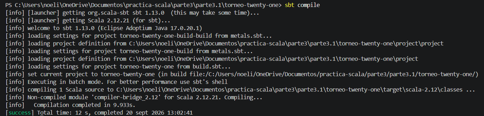
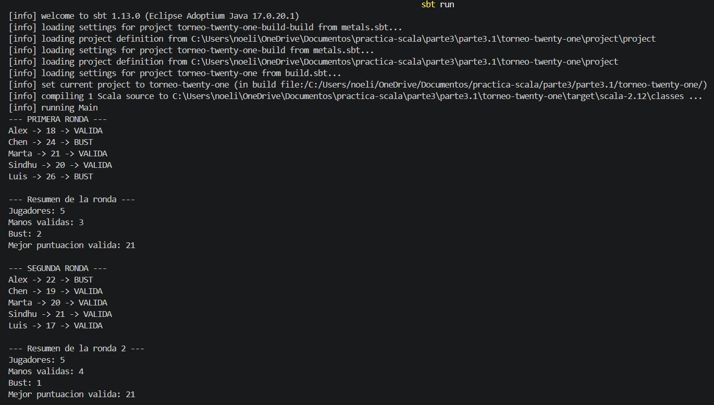
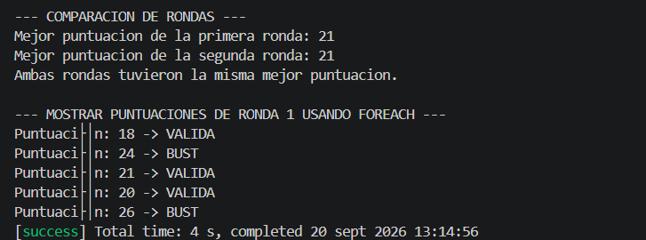

# Mini proyecto 3.1 — Torneo de Twenty-One

## Entorno

-Visual Studio Code
-Metals
-Scala 2.12.21
-JDK 17
-sbt

## Descripción

El programa calcula los puntos de varios jugadores en 2 rondas:

* Comprueba si la mano es válida ($\le 21$) o si se han pasado (`BUST`).

* Muestra el resumen de cada ronda y cuál tuvo mejor puntuación.

* Compara el uso de `while` y `foreach`.

## Estructura

```
torneo-twenty-one/
├── build.sbt
├── project/
└── src/
    └── main/
        └── scala/
            └── Main.scala

```

## Funciones utilizadas

-bust
-estadoMano
-mejorMano

## Ejecución

```bash
sbt compile
sbt run
```

## Comparación entre while y foreach

1. **¿Cuál necesita un contador?**

   * **`while`**: Sí, necesita un contador manual como `var i = 0`.

   * **`foreach`**: No necesita contador.

2. **¿Cuál necesita una variable mutable para recorrer la colección?**

   * **`while`**: Sí, usa una variable `var` para ir cambiando el índice.

   * **`foreach`**: No usa variables mutables para hacer el recorrido.

3. **¿Cuál se aproxima más al estilo funcional?**

   * **`foreach`**, porque evita usar `var` y contadores manuales, haciendo el código más limpio como se enseña en Datacamp.

## 4. Capturas de pantalla

#### Compilación (`sbt compile`)


#### Ejecución (`sbt run`), Salida Primera Ronda y Segunda Ronda


#### Comparación Final y Success
